# İNSANSIZ HAVA ARACI YER KONTROL İSTASYONU YAZILIMI

**Staj Raporu**

---

**Öğrenci:** [Öğrenci Adı Soyadı]
**Öğrenci Numarası:** [Numara]
**Bölüm:** [Bölüm Adı]
**Staj Yeri:** Gökkubbe Teknoloji A.Ş.
**Staj Tarihleri:** [Başlangıç Tarihi] – [Bitiş Tarihi]
**Staj Süresi:** [Toplam İş Günü] iş günü
**Kurum Danışmanı:** [Danışman Adı Soyadı, Unvanı]
**Bölüm Danışmanı:** [Öğretim Üyesi Adı Soyadı, Unvanı]

---

## KISALTMALAR

| Kısaltma | Açılımı |
|---|---|
| API | Application Programming Interface (Uygulama Programlama Arayüzü) |
| CSV | Comma Separated Values (Virgülle Ayrılmış Değerler) |
| CVD | Color Vision Deficiency (Renk Görme Eksikliği) |
| EKF | Extended Kalman Filter (Genişletilmiş Kalman Filtresi) |
| FC | Flight Controller (Uçuş Kontrolcüsü) |
| FOV | Field of View (Görüş Alanı) |
| GCS | Ground Control Station (Yer Kontrol İstasyonu) |
| GPS | Global Positioning System (Küresel Konumlama Sistemi) |
| İHA | İnsansız Hava Aracı |
| KML | Keyhole Markup Language |
| MAVLink | Micro Air Vehicle Link (İHA Haberleşme Protokolü) |
| RSSI | Received Signal Strength Indicator (Alınan Sinyal Gücü Göstergesi) |
| RTL | Return To Launch (Kalkış Noktasına Dönüş) |
| SAR | Search and Rescue (Arama Kurtarma) |
| SITL | Software In The Loop (Yazılım Döngüde Simülasyon) |
| TTS | Text To Speech (Metin Okuma) |
| UDP | User Datagram Protocol |

---

## 1 FİRMA BİLGİLERİ

Staj, **Gökkubbe Teknoloji A.Ş.** bünyesinde gerçekleştirilmiştir [14].

### Kısa tarihçe

Firma, yeni nesil savunma teknolojileri geliştirmek amacıyla 2022 yılında kurulmuştur. Merkezi Ankara'nın Sincan ilçesinde bulunmaktadır. Türkiye'nin köklü savunma sanayii kuruluşlarından Makina ve Kimya Endüstrisi A.Ş. (MKE) iştiraki olarak faaliyet göstermektedir.

### Faaliyet alanları

Firmanın faaliyetleri üç ana başlıkta toplanmaktadır: yapay zekâ ile çalışan otonom sistemler, insansız hava aracı teknolojileri ve entegre savunma çözümleri. Ürün portföyünde otonom hava araçları, radar ve hedef tespit sistemleri, akıllı fırlatıcılar, insansız kara araçları, uç birim yapay zekâ (edge AI) çözümleri ve **yer kontrol yazılımları** yer almaktadır. Firma tanıtım materyallerinde sekizden fazla aktif ürün bildirilmektedir.

Yer kontrol yazılımı ürünleri **SkyDome G-GCS** ve **GRAICON**, çoklu protokol desteğiyle görev yönetimi sağlayan sistemler olarak tanımlanmaktadır. Bu staj çalışmasında geliştirilen yazılım da aynı alana, yani insansız hava araçlarının yerden izlenmesi ve yönetilmesi konusuna yöneliktir.

### Misyon ve teknik yaklaşım

Firma, modern savaşın değişen taleplerini karşılayacak sistemler geliştirmeyi hedeflemektedir. Sistemlerinde öne çıkardığı nitelikler yüksek hassasiyet, operasyonel güvenilirlik, elektronik savaşa karşı dayanıklılık ve ölçeklenebilirliktir. Ürünlerinde yapay zekâ tabanlı karar verme, gerçek zamanlı veri işleme ve sahaya uyarlanabilirlik esas alınmaktadır.

### Kullanılan teknolojiler

Firma ürünlerinde yapay zekâ ve gerçek zamanlı veri işleme altyapıları, X bandı üç boyutlu gözetim radarları ve NVIDIA Jetson tabanlı gömülü işlem platformları kullanılmaktadır. Tasarımdan seri üretime kadar uzanan mühendislik altyapısı Ankara'daki tesislerde bulunmaktadır.

> **[BU KISIM FİRMADAN ALINARAK DOLDURULACAK]**
> **Mühendis kadrosu:** Firmanın kamuya açık tanıtım sayfasında çalışan sayısı belirtilmemektedir. Bu bilgi staj yapılan birimden temin edilerek yazılmalıdır: bilgisayar/elektrik/elektronik mühendisi olarak çalışan eleman sayısı, görev dağılımı ve yürüttükleri çalışmalar.
>
> **Staj yapılan birim:** [Yazılım / Ar-Ge / hangi birimde çalışıldıysa]
>
> Mümkünse iş yerinde, staj yapan kişinin de karede bulunduğu bir fotoğraf bu bölüme eklenmelidir. Fotoğraf eklenirse şekil numaralandırması buna göre kaydırılmalıdır.

---

## 2 GİRİŞ

Bu staj çalışması kapsamında, insansız hava araçlarının (İHA) yerden izlenmesi ve yönetilmesi için kullanılan bir **yer kontrol istasyonu** (Ground Control Station, GCS) yazılımı geliştirilmiştir. Yazılım, açık kaynaklı ArduPilot otopilot sistemiyle [1] MAVLink haberleşme protokolü [2] üzerinden iletişim kurmakta; uçuş telemetrisini gerçek zamanlı olarak görüntülemekte, otonom görev planlaması yapmakta ve uçuş güvenliğini artıran çeşitli denetimler sağlamaktadır.

Staj yapılan Gökkubbe Teknoloji A.Ş., insansız hava aracı teknolojileri ve yer kontrol yazılımları alanında faaliyet göstermektedir [14]; dolayısıyla çalışma konusu firmanın faaliyet alanıyla doğrudan örtüşmektedir.

Çalışma masaüstü uygulaması olarak Python programlama dili ve PyQt5 arayüz kütüphanesi [3] kullanılarak gerçekleştirilmiştir. Geliştirme süreci boyunca gerçek bir uçuş kontrolcüsü yerine, ArduPilot projesinin sunduğu SITL (Software In The Loop) simülasyon ortamı kullanılmış; böylece donanım riski olmadan gerçekçi testler yapılabilmiştir.

Staj süresince yürütülen çalışma iki ana aşamadan oluşmuştur. Birinci aşamada mevcut kod tabanı incelenerek hatalar tespit edilmiş ve giderilmiş; ikinci aşamada ise kullanıcı ihtiyaçları doğrultusunda yeni özellikler geliştirilmiştir. Her iki aşamada da yapılan değişikliklerin doğruluğunu kalıcı olarak güvence altına almak amacıyla otomatik test altyapısı kurulmuş ve proje sonunda 203 otomatik test yazılmıştır.

Projenin kaynak kodları sürüm kontrol sistemi (Git) ile yönetilmiş ve genel erişime açık bir depoda saklanmıştır. Toplam kaynak kod büyüklüğü 9.341 satır, test kodu büyüklüğü ise 3.649 satırdır.

---

## 3 PROJEDE KULLANILAN YAZILIM VE DONANIM ARAÇLARI

Bu bölümde projede kullanılan araçlar ve bu araçların seçilme gerekçeleri açıklanmaktadır. Kullanılan yazılım bileşenleri ve sürümleri Tablo 1'de özetlenmiştir.

**Tablo 1.** Projede kullanılan yazılım araçları ve görevleri

| Araç | Sürüm | Görevi |
|---|---|---|
| Python | 3.9+ | Uygulamanın geliştirildiği programlama dili |
| PyQt5 | 5.15+ | Masaüstü grafik arayüz kütüphanesi |
| PyQtWebEngine | 5.15+ | Harita bileşeninin gömülü tarayıcıda çalıştırılması |
| pymavlink | 2.4+ | MAVLink protokol kütüphanesi |
| matplotlib | 3.5+ | Uçuş verisi grafikleri |
| pyserial | 3.5+ | Seri port üzerinden telemetri bağlantısı |
| PyInstaller | 5.13+ | Tek dosyalık çalıştırılabilir paket üretimi |
| Leaflet | 1.9.4 | Harita görselleştirme kütüphanesi |
| ArduPilot SITL | 4.7 | Uçuş kontrolcüsü simülasyonu |
| Git | 2.x | Sürüm kontrolü |

**MAVLink protokolü**, insansız hava araçları ile yer istasyonları arasındaki haberleşme için geliştirilmiş, ikili (binary) biçimde çalışan hafif bir mesajlaşma protokolüdür [2]. Protokol; konum, hız, yönelim, pil durumu gibi telemetri verilerinin araçtan yer istasyonuna aktarılmasını ve komutların ters yönde iletilmesini sağlar. Protokolün MAVLink 1 ve MAVLink 2 olmak üzere iki sürümü bulunmaktadır; MAVLink 2, mesajlara geriye dönük uyumlu şekilde yeni alanlar eklenebilmesine olanak tanır. Bu ayrımın proje açısından önemi Bölüm 18'de ayrıntılı olarak ele alınmıştır.

**ArduPilot**, çok rotorlu hava araçları, sabit kanatlı uçaklar, kara ve deniz araçları için geliştirilmiş açık kaynaklı bir otopilot yazılımıdır [1]. **SITL**, bu otopilot yazılımının gerçek donanım yerine bilgisayarda çalıştırılmasını sağlayan simülasyon modudur. SITL sayesinde uçuş kontrolcüsünün gerçek davranışı — prearm denetimleri, uçuş modu geçişleri, görev yürütme mantığı — fiziksel bir araç olmadan test edilebilmektedir.

**PyQt5**, C++ ile yazılmış Qt arayüz kütüphanesinin Python bağlamalarıdır [3]. Projede pencere yönetimi, olay döngüsü, iş parçacığı (thread) yönetimi ve sinyal-yuva (signal-slot) haberleşme mekanizması için kullanılmıştır.

**Leaflet**, açık kaynaklı bir JavaScript harita kütüphanesidir [6]. Projede harita bileşeni, PyQtWebEngine içerisinde çalışan gömülü bir HTML sayfası olarak gerçekleştirilmiştir. Harita altlıkları olarak Esri World Imagery (uydu görüntüsü) ve OpenStreetMap (sokak haritası) servisleri kullanılmaktadır [7].

Donanım tarafında geliştirme, standart bir masaüstü/dizüstü bilgisayar üzerinde yürütülmüştür. Gerçek uçuş donanımı olarak ArduPilot uyumlu bir uçuş kontrolcüsü ve telemetri radyosu desteklenmekte; yazılım hem UDP/TCP ağ bağlantısı hem de seri port üzerinden haberleşebilmektedir.

---

## 4 PROBLEM TANIMI

Piyasada Mission Planner ve QGroundControl gibi olgunlaşmış yer kontrol istasyonu yazılımları bulunmaktadır [5]. Bu yazılımlar geniş özellik kümesine sahiptir; ancak staj kapsamında incelenen kullanım senaryoları açısından bazı sınırlılıklar tespit edilmiştir:

**Arayüz karmaşıklığı.** Mevcut yazılımlar çok sayıda özelliği tek bir arayüzde sunduğundan, belirli bir göreve odaklanmış operatör için gereksiz bilgi yoğunluğu oluşmaktadır. Örneğin bir haritalama uçuşunda hedef waypoint mesafesi kritikken, aynı ekranda onlarca ilgisiz gösterge yer almaktadır.

**Göreve özgü rota üretiminin sınırlılığı.** Bir alanın sistematik olarak taranması veya bir bölgede arama deseni uygulanması, elle waypoint yerleştirerek yapıldığında hem zaman alıcı hem de hata açısından risklidir.

**Uçuş öncesi doğrulama eksikliği.** Yanlışlıkla güvenlik sınırı dışına yerleştirilmiş bir waypoint, normal şartlarda ancak uçuş sırasında failsafe mekanizması devreye girdiğinde fark edilmektedir. Bu durum hem görevin yarıda kalmasına hem de güvenlik riskine yol açmaktadır.

**Türkçe dil desteği ve sesli geri bildirim.** İncelenen yazılımlarda Türkçe arayüz ve sesli uyarı desteği bulunmamaktadır. Oysa operatörün gözünü ekrandan ayırdığı anlarda kritik uyarıların sesli olarak iletilmesi, gerçek bir kontrol istasyonunda güvenlik açısından belirleyici olabilmektedir.

Bu tespitler doğrultusunda geliştirilen yazılımın hedefleri şu şekilde belirlenmiştir: göreve göre sadeleşen bir arayüz sunmak, göreve özgü rotaları otomatik üretmek, görevi yüklemeden önce güvenlik denetimi yapmak, kritik durumlarda sesli uyarı vermek ve tüm bunları Türkçe arayüzle sağlamak.

---

## 5 SİSTEM MİMARİSİ

Yazılımın en kritik tasarım kararı, MAVLink haberleşmesinin arayüzden tamamen ayrılmasıdır. Grafik arayüz kütüphaneleri tek iş parçacıklı (single-threaded) çalışır; arayüz iş parçacığında uzun süren bir ağ işlemi yapılması, uygulamanın donmasına yol açar. Ayrıca MAVLink soketine birden fazla iş parçacığının aynı anda erişmesi, mesajların bozulmasına ve protokolün senkronizasyonunu kaybetmesine neden olur.

Bu nedenle sistem katmanlı bir yapıda tasarlanmıştır. Sistem mimarisi Şekil 1'de gösterilmektedir.

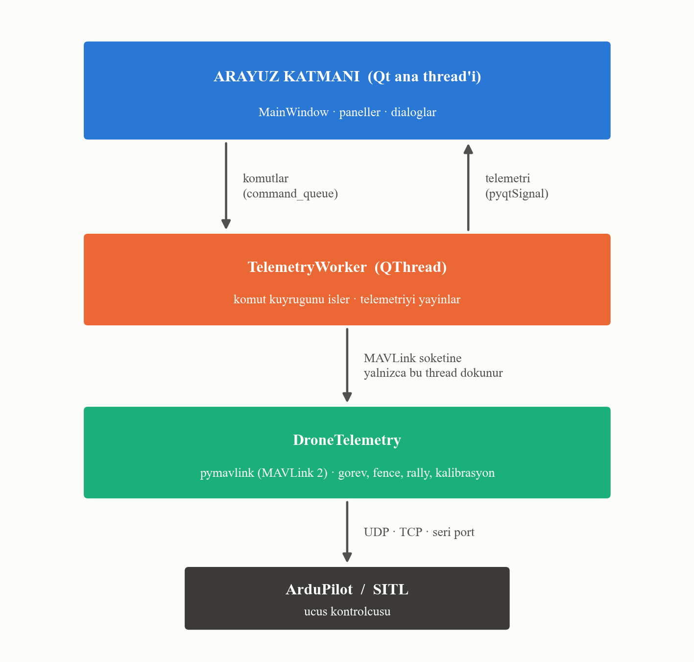

**Şekil 1.** Katmanlı sistem mimarisi ve iş parçacıkları arası haberleşme

Şekil 1'de görüldüğü üzere mimari üç katmandan oluşmaktadır:

**Arayüz katmanı**, Qt ana iş parçacığında çalışır ve kullanıcıyla etkileşimin tamamını yürütür. Bu katman MAVLink soketine hiçbir koşulda doğrudan erişmez.

**TelemetryWorker** katmanı, ayrı bir iş parçacığında (QThread) çalışır. Arayüzden gelen komutlar bir **komut kuyruğuna** (`command_queue`) yazılır; worker bu kuyruğu işler. Ters yönde, araçtan gelen telemetri verileri Qt'nin sinyal mekanizmasıyla (pyqtSignal) arayüze iletilir. Bu iki yönlü, kuyruk tabanlı haberleşme sayesinde iki iş parçacığı arasında paylaşılan değiştirilebilir durum bulunmamaktadır.

**DroneTelemetry** katmanı, MAVLink protokolünün kendisini gerçekleştirir: mesajların çözümlenmesi, görev yükleme/indirme protokolü, kalibrasyon komutları ve parametre okuma/yazma işlemleri bu katmanda yer alır.

Bu ayrımın yanı sıra, hesaplama ağırlıklı işler Qt ve MAVLink bağımlılığı olmayan **saf fonksiyon modüllerine** taşınmıştır. Bu modüller Şekil 2'de listelenmiştir.

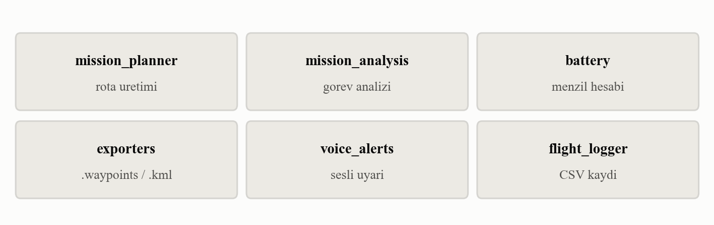

**Şekil 2.** Arayüz ve protokolden bağımsız hesaplama modülleri

Şekil 2'de gösterilen modüllerin arayüzden bağımsız olması, doğrudan ve hızlı test edilebilmelerini sağlamaktadır. Örneğin rota üretim geometrisinin 29 testi, herhangi bir pencere açılmadan ve ağ bağlantısı kurulmadan saniyenin binde biri mertebesinde çalışmaktadır.

---

## 6 TELEMETRİ VE UÇUŞ KONTROL ARAYÜZÜ

Uygulamanın üst kısmında, bağlantı durumu ve temel araç durumunu özetleyen bir durum çubuğu yer almaktadır. Bu çubuk Şekil 3'te görülmektedir.


**Şekil 3.** Bağlantı, ARM durumu, uçuş modu ve süre bilgilerini gösteren üst durum çubuğu

Şekil 3'te soldan sağa sırasıyla bağlantı rozeti (bağlantı türü, port ve durum), ARM/DISARM rozeti, aktif uçuş modu, uçuş süresi sayacı ve işlem butonları yer almaktadır. Bağlantı koptuğunda rozet kırmızıya döner ve "Yeniden Bağlan" butonu yanıp sönerek dikkat çeker.

Ana telemetri paneli, uçuşun anlık durumunu gösteren kartlardan ve yapay ufuk göstergesinden oluşmaktadır. Panel Şekil 4'te gösterilmiştir.

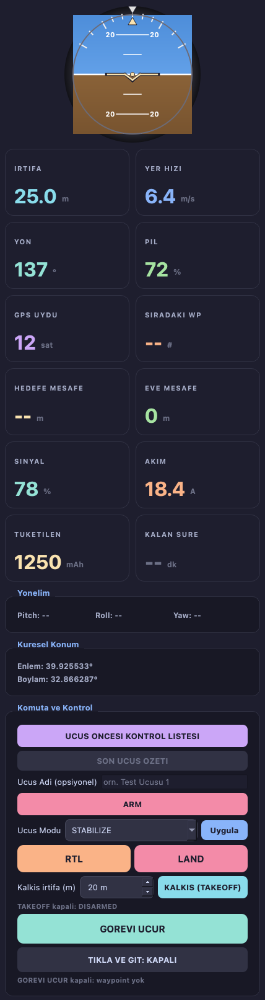

**Şekil 4.** Yapay ufuk ve telemetri kartları

Şekil 4'te görülen yapay ufuk, araçtan gelen `ATTITUDE` mesajındaki yuvarlanma (roll) ve yunuslama (pitch) açılarıyla gerçek zamanlı olarak güncellenmektedir. Altındaki kartlar; irtifa, yer hızı, yön, pil yüzdesi, GPS uydu sayısı, sıradaki waypoint numarası, hedefe ve kalkış noktasına olan mesafe, telemetri sinyal gücü, anlık akım, tüketilen enerji ve kalan uçuş süresi değerlerini göstermektedir.

Kartlar yalnızca değer göstermekle kalmaz, eşik değerlerine göre renk değiştirir. Örneğin GPS uydu sayısı altıdan azsa kart kırmızı, altı ile on arasındaysa sarı, onun üzerindeyse mor renge döner. Bu yaklaşım, operatörün sayıyı okumadan önce durumu çevresel görüşle algılamasını sağlamaktadır.

Yazılımın işlediği MAVLink mesajları Tablo 2'de listelenmiştir.

**Tablo 2.** İşlenen MAVLink mesajları ve sağladıkları bilgiler

| Mesaj | Sağladığı bilgi |
|---|---|
| HEARTBEAT | ARM durumu, aktif uçuş modu |
| ATTITUDE | Yuvarlanma, yunuslama, sapma açıları |
| GLOBAL_POSITION_INT | Enlem, boylam, kalkışa göre irtifa |
| VFR_HUD | Yer hızı, yön, tırmanma hızı, gaz yüzdesi |
| SYS_STATUS | Pil yüzdesi, gerilim, sensör sağlık bitleri |
| BATTERY_STATUS | Anlık akım, tüketilen enerji, hücre gerilimleri |
| GPS_RAW_INT | Uydu sayısı, konum kilidi türü |
| HOME_POSITION | Kalkış noktası koordinatları |
| MISSION_CURRENT | Aracın yöneldiği waypoint numarası |
| EKF_STATUS_REPORT | Konum kestirim filtresinin durumu |
| STATUSTEXT | Otopilot metin mesajları (prearm uyarıları vb.) |
| PARAM_VALUE | Otopilot parametre değerleri |
| RADIO_STATUS | Telemetri radyosu sinyal gücü |
| MAG_CAL_PROGRESS / MAG_CAL_REPORT | Pusula kalibrasyonu ilerleme ve sonucu |
| COMMAND_LONG | Otopilotun GCS'ten istediği kalibrasyon pozisyonu |

---

## 7 GÖREV PLANLAMA

Otonom uçuş, önceden tanımlanmış bir waypoint dizisinin araca yüklenmesiyle gerçekleştirilir. Görev planlama paneli Şekil 5'te gösterilmiştir.

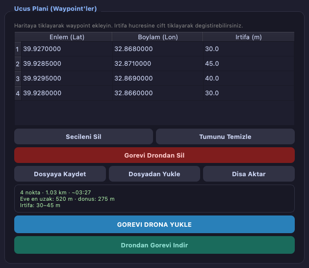

**Şekil 5.** Waypoint tablosu, dosya işlemleri ve görev analizi özeti

Şekil 5'te görüldüğü gibi kullanıcı haritaya tıklayarak waypoint ekler; noktalar tabloda listelenir ve irtifa değerleri tablo üzerinden düzenlenebilir. Panelin alt kısmında, o anki görevin analiz özeti yer almaktadır; bu özet Bölüm 8'de ayrıntılı olarak ele alınmaktadır.

Görev yükleme işlemi MAVLink'in görev protokolü üzerinden yürütülür. Protokol, yer istasyonunun toplam nokta sayısını bildirmesi, otopilotun noktaları tek tek istemesi ve son noktadan sonra onay (ACK) göndermesi şeklinde işler.

Bu protokolde kritik bir ayrıntı bulunmaktadır: ArduPilot'ta görev tablosunun **sıfırıncı satırı kalkış noktası (home) için ayrılmıştır** ve otopilot bu satırı gerçek bir navigasyon komutu olarak yürütmez. Dolayısıyla kullanıcının gördüğü birinci waypoint, protokolde bir numaralı sıraya yazılmalıdır. Bu kural gözden kaçırıldığında araç ilk noktaya hiç uğramadan ikinci noktadan başlar. Proje kapsamında bu davranış hem otomatik testle hem de SITL üzerinde gerçek otopilotla doğrulanmıştır.

Görev, araca yüklendikten sonra geri okunabilmektedir. Bu "readback" işlevi, yüklemenin otopilot hafızasında doğru şekilde saklandığını doğrulamak amacıyla eklenmiştir.

---

## 8 GÖREV ÖNİZLEME VE GÜVENLİK ANALİZİ

Bölüm 4'te belirtildiği üzere, güvenlik sınırı dışına yerleştirilmiş bir waypoint normal şartlarda ancak uçuş sırasında fark edilmektedir. Bu riski ortadan kaldırmak amacıyla, görev araca yüklenmeden önce çalışan bir analiz katmanı geliştirilmiştir.

Analiz şu ölçümleri üretmektedir: toplam uçuş mesafesi, bacak bacak mesafe dağılımı, seyir hızına göre tahmini uçuş süresi, kalkış noktasına olan en uzak mesafe, son noktadan eve dönüş mesafesi ve irtifa aralığı. Tahmini süre hesabında otopilottan okunan `WPNAV_SPEED` parametresi kullanılmakta, parametre okunamadığında ise ArduPilot varsayılanı olan 5 m/s değeri esas alınmaktadır.

Ölçümlerin yanı sıra aşağıdaki güvenlik denetimleri yapılmaktadır:

- Dairesel güvenlik sınırı (geofence) yarıçapının dışında kalan waypoint'ler
- Poligon güvenlik sınırının dışında kalan waypoint'ler
- `FENCE_ALT_MAX` parametresiyle tanımlanan irtifa limitini aşan waypoint'ler
- Sıfır veya negatif irtifa değerleri
- Birbirine üç metreden yakın ardışık noktalar (yanlış tıklama şüphesi)

Uyarılar iki seviyede sınıflandırılmaktadır. "Hata" seviyesindeki bulgular görev yüklenmeden önce onay penceresiyle kullanıcıya bildirilir; "uyarı" seviyesindekiler yalnızca özet alanında gösterilir. Geofence ihlali tespit edilen bir görevin analiz özeti Şekil 6'da görülmektedir.


**Şekil 6.** Güvenlik sınırı ihlali tespit edildiğinde gösterilen analiz özeti

Şekil 6'da görüldüğü üzere özet alanı, sorun tespit edildiğinde kırmızı çerçeveye dönüşmekte ve bulunan sorun sayısını bildirmektedir. Bu tasarım, kullanıcının yükleme butonuna basmadan önce durumu fark etmesini amaçlamaktadır.

---

## 9 OTOMATİK ROTA ÜRETİMİ

Arayüzde "Standart", "Arama Kurtarma" ve "Haritalama" olmak üzere üç görev modu bulunmaktadır. Staj başlangıcında bu modlar yalnızca görsel bir işlev görmekte; bazı telemetri kartlarını gizlemek, sekme sırasını ve vurgu rengini değiştirmek dışında bir davranış üretmemekteydi. Bu bölümde anlatılan çalışmayla modlar, göreve özgü rota üreten işlevsel bileşenlere dönüştürülmüştür.

Her iki modda da kullanıcının haritaya tıkladığı noktalar girdi olarak kullanılmaktadır. Bu tercih bilinçlidir: haritada ayrı bir çizim modu gerektirmediği için hem geliştirme karmaşıklığı hem de kullanıcının öğrenmesi gereken etkileşim sayısı azalmaktadır.

### Haritalama modu: alan tarama rotası

Haritalama modunda, kullanıcının işaretlediği noktalar bir **poligon** tanımlar ve bu poligonun içini sistematik olarak tarayan gidiş-dönüş rotası üretilir. Literatürde *boustrophedon* (öküzün tarlayı sürmesi) olarak adlandırılan bu desen, kapsama amaçlı rota planlamasının temel yaklaşımlarından biridir [10].

Algoritma şu adımları izlemektedir:

1. Poligon köşeleri, bölgenin ağırlık merkezine oturtulmuş yerel bir düzleme (metre birimli) izdüşürülür.
2. Düzlem, tarama hatları yatay olacak şekilde istenen açı kadar döndürülür.
3. Belirlenen hat aralığıyla yatay doğrular üretilir; her doğrunun poligon kenarlarıyla kesişim noktaları hesaplanır.
4. Kesişimler ikişerli gruplanarak poligonun içinde kalan parçalar bulunur.
5. Ardışık hatlar ters yönde gezilecek şekilde sıralanır; böylece araç hat sonunda boşa dönüş yapmaz.
6. Sonuç, döndürme geri alınarak coğrafi koordinatlara çevrilir.

Hat aralığı iki şekilde belirlenebilmektedir. Kullanıcı doğrudan metre cinsinden bir değer girebilir veya kamera parametrelerinden hesaplatabilir. İkinci durumda kullanılan bağıntı şu şekildedir:

```
yer_genişliği = 2 × irtifa × tan(FOV / 2)
hat_aralığı   = yer_genişliği × (1 − örtüşme_oranı)
```

Burada FOV kameranın yatay görüş açısı, örtüşme oranı ise komşu şeritlerin birbirini kaplama yüzdesidir. Örneğin 100 metre irtifada, 90 derece görüş açısına sahip bir kamerayla ve %30 yan örtüşmeyle hat aralığı 140 metre olarak hesaplanmaktadır.

Algoritmanın beşgen bir alan üzerindeki çıktısı Şekil 7'de gösterilmektedir.

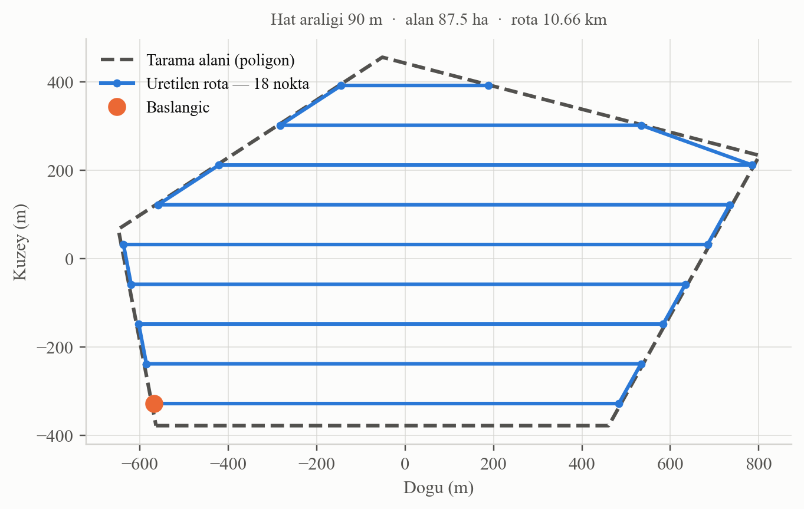

**Şekil 7.** Beşgen bir alan için üretilen tarama rotası (hat aralığı 90 m)

Şekil 7'de kesikli çizgi kullanıcının tanımladığı alanı, düz mavi çizgi ise üretilen rotayı göstermektedir. Ardışık hatların ters yönde gezildiği, hat uçlarının poligon kenarlarına tam olarak oturduğu ve rotanın alan dışına taşmadığı görülmektedir.

### Arama Kurtarma modu: genişleyen kare deseni

Arama Kurtarma modunda, kullanıcının işaretlediği ilk nokta arama merkezi olarak kabul edilir ve merkezden dışa doğru genişleyen kare deseni üretilir. Bu desen, havacılık ve denizcilik arama kurtarma uygulamalarında son bilinen konumun belirsizlik yarıçapı içinde kalan bölgenin taranması için kullanılan standart yöntemlerden biridir [11].

Desende bacak uzunlukları *d, d, 2d, 2d, 3d, 3d, …* dizisini izler ve her bacak sonunda 90 derecelik dönüş yapılır. Burada *d* hat aralığıdır ve gözlemcinin yanal görüş mesafesine göre belirlenir. Desenin çıktısı Şekil 8'de gösterilmektedir.

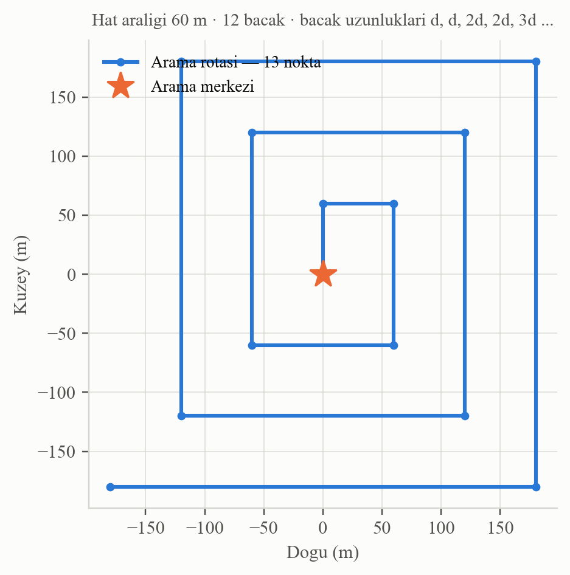

**Şekil 8.** Merkezden dışa doğru genişleyen kare arama deseni (hat aralığı 60 m, 12 bacak)

Şekil 8'de merkezden başlayan rotanın her turda genişlediği ve taranan alanın merkez çevresinde eşit yoğunlukta kaldığı görülmektedir.

### Rota üretim arayüzü

Her iki mod da ortak bir parametre penceresi üzerinden kullanılmaktadır. Pencere Şekil 9'da gösterilmiştir.

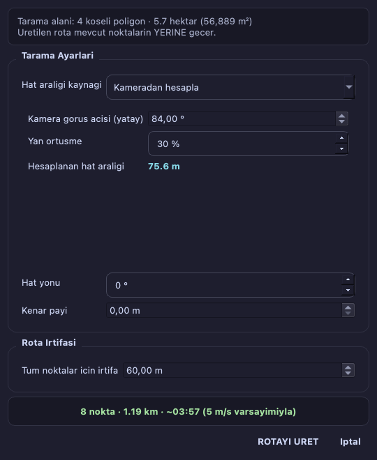

**Şekil 9.** Kamera parametrelerinden hat aralığı hesaplanan rota üretme penceresi

Şekil 9'da görüldüğü gibi pencere, parametreler değiştikçe güncellenen bir **canlı önizleme** sunmaktadır. Önizlemede üretilecek nokta sayısı, toplam rota uzunluğu ve tahmini süre yer almaktadır. Parametreler geçersiz bir sonuç üretiyorsa (örneğin kenar payı alanın tamamını kaplıyorsa) önizleme alanı hata mesajı göstermekte ve üretme butonu devre dışı kalmaktadır.

Görev modlarının davranışı Tablo 3'te özetlenmiştir.

**Tablo 3.** Görev modları ve ürettikleri rotalar

| Mod | Girdi | Üretilen rota | Temel parametre |
|---|---|---|---|
| Standart | — | Rota üretimi yok, elle waypoint girilir | — |
| Haritalama | En az 3 nokta (poligon) | Alan tarama rotası (boustrophedon) | Hat aralığı veya kamera FOV + örtüşme |
| Arama Kurtarma | 1 nokta (merkez) | Genişleyen kare deseni | Hat aralığı, bacak sayısı, başlangıç yönü |

---

## 10 GÜVENLİK SİSTEMLERİ

Güvenlik paneli, uçuş öncesi ve uçuş sırasında araç durumunu izleyen denetimleri bir arada sunmaktadır. Panel Şekil 10'da gösterilmiştir.

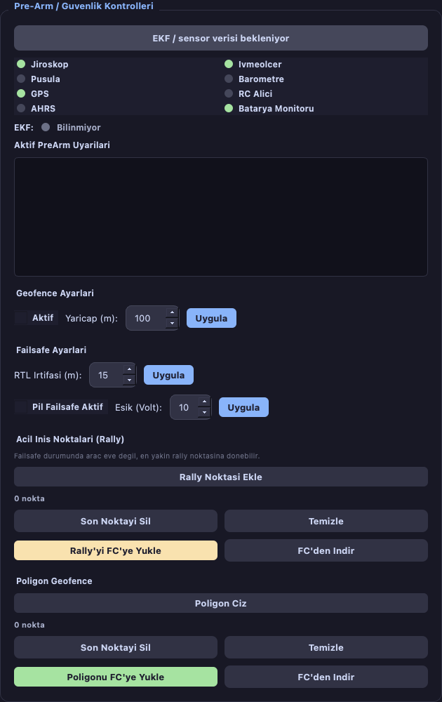

**Şekil 10.** Sensör durumu, geofence ayarları, failsafe parametreleri ve acil iniş noktaları

Şekil 10'da görülen panel dört bölümden oluşmaktadır:

**Sensör sağlık durumu.** Otopilottan gelen `SYS_STATUS` mesajındaki bit maskeleri çözümlenerek jiroskop, ivmeölçer, pusula, barometre, GPS, uzaktan kumanda alıcısı, EKF ve pil sensörlerinin durumu gösterilmektedir. Bir sensörün araçta hiç raporlanmaması ile arızalı olması ayrı durumlar olarak ele alınmakta; ilki nötr, ikincisi kırmızı gösterilmektedir.

**Prearm uyarıları.** ArduPilot, araç ARM edilmeden önce bir dizi denetim yapar ve başarısız olanları `STATUSTEXT` mesajıyla bildirir. Ancak bu mesajlar yalnızca gerçek bir ARM denemesinde bir kez gönderilmektedir. Uyarıların panelde güncel kalması için yazılım, araç DISARM durumdayken dört saniyede bir `MAV_CMD_RUN_PREARM_CHECKS` komutu göndererek otopilotun denetimleri yeniden çalıştırmasını istemektedir.

**Geofence ayarları.** Dairesel güvenlik sınırı (yarıçap ve etkinlik durumu) ile poligon güvenlik sınırı bu panelden yönetilmektedir. Poligon, harita üzerine tıklanarak çizilmekte ve otopilota yüklenebilmektedir. Dairesel sınır, kalkış noktası merkez alınarak harita üzerinde görsel olarak da gösterilmektedir.

**Acil iniş noktaları (rally point).** ArduPilot'ta failsafe durumu tetiklendiğinde araç, kalkış noktasına dönmek yerine en yakın acil iniş noktasına yönelebilmektedir. Bu noktalar harita üzerine tıklanarak eklenmekte, otopilota yüklenmekte ve harita üzerinde "H" işaretiyle gösterilmektedir.

### Acil durum klavye kısayolları

Acil bir durumda fareyle doğru butonu aramak zaman kaybettirmektedir. Bu nedenle kritik komutlar için klavye kısayolları tanımlanmıştır: `Ctrl+R` kalkış noktasına dönüş (RTL), `Ctrl+L` bulunulan noktaya iniş (LAND), `Ctrl+Shift+D` motorları durdurma (DISARM), `Ctrl+K` uçuş öncesi kontrol listesi, `Ctrl+E` son uçuş özeti.

ARM komutu bilinçli olarak kısayola bağlanmamıştır; kazara tuş kombinasyonuna basılması durumunda motorların çalışması ciddi bir risk oluşturacaktır. Ayrıca DISARM kısayolu yalnızca araç ARM durumdayken işlem yapmakta, onay penceresi ise korunmaktadır.

---

## 11 KALİBRASYON SİHİRBAZI

Bir insansız hava aracı ilk kez kullanılmadan önce veya sensörleri şüpheli davranmaya başladığında, pusula ve ivmeölçer sensörlerinin kalibre edilmesi gerekmektedir. Staj başlangıcında yazılım bu sensörlerin durumunu gösterebiliyor ancak kalibrasyonu başlatamıyordu; kullanıcının bu işlem için Mission Planner gibi harici bir yazılıma geçmesi gerekiyordu.

Geliştirilen sihirbaz üç sekmeden oluşmaktadır: Pusula, İvmeölçer ve Diğer (yatay düzlem, jiroskop, barometre).

### Pusula kalibrasyonu

Pusula kalibrasyonu, aracın her eksende döndürülerek manyetik alan ölçümlerinin toplanması esasına dayanır. Süreç `MAV_CMD_DO_START_MAG_CAL` komutuyla başlatılır; otopilot ilerlemeyi `MAG_CAL_PROGRESS` mesajlarıyla bildirir ve işlem bitince `MAG_CAL_REPORT` gönderir. Kalibrasyon ekranı Şekil 11'de gösterilmiştir.

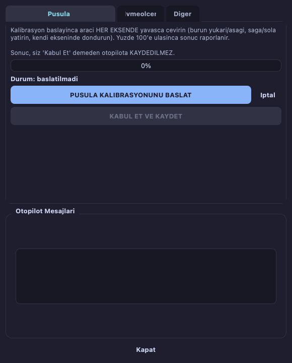

**Şekil 11.** Canlı ilerleme göstergesi ile pusula kalibrasyonu

Şekil 11'de görülen ilerleme çubuğu, otopilottan gelen tamamlanma yüzdesiyle gerçek zamanlı güncellenmektedir. Tasarımda önemli bir güvenlik kararı alınmıştır: kalibrasyon `autosave=0` parametresiyle başlatılmaktadır. Bu sayede sonuç, kullanıcı "KABUL ET VE KAYDET" butonuna basmadan otopilota kalıcı olarak yazılmamaktadır. Aksi hâlde kötü sonuçlanmış bir kalibrasyon kazara kalıcı hâle gelebilirdi.

### İvmeölçer kalibrasyonu

İvmeölçer kalibrasyonu, aracın altı farklı pozisyona getirilmesini gerektirir: düz, sol yan, sağ yan, burun aşağı, burun yukarı ve sırt üstü. Sihirbaz ekranı Şekil 12'de gösterilmiştir.

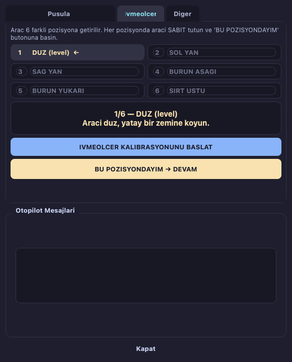

**Şekil 12.** Altı pozisyonlu ivmeölçer kalibrasyonu, aktif adım vurgulanmış durumda

Şekil 12'de görüldüğü üzere altı pozisyon liste hâlinde gösterilmekte, tamamlananlar yeşil onay işaretiyle, aktif olan ise sarı renkle vurgulanmaktadır. Kullanıcı aracı istenen pozisyona getirip "BU POZİSYONDAYIM" butonuna basmaktadır.

Bu özelliğin geliştirilmesi sırasında, protokolün işleyişine dair önemli bir bulgu elde edilmiştir; bu bulgu Bölüm 18'de ayrıntılı olarak açıklanmaktadır.

### Güvenlik kısıtı

Kalibrasyon işlemleri yalnızca araç **DISARM** durumdayken başlatılabilmektedir. Araç ARM edildiğinde sihirbazdaki tüm başlatma butonları devre dışı kalmakta ve kırmızı bir uyarı gösterilmektedir. Bu kısıt hem arayüz seviyesinde hem de komutları kuyruğa alan katmanda ayrı ayrı uygulanmaktadır.

---

## 12 PİL YÖNETİMİ VE EVE DÖNÜŞ MENZİLİ

Staj başlangıcında yazılım, pil durumunu yalnızca `SYS_STATUS` mesajındaki yüzde tahminiyle göstermekteydi. Ancak bu değer otopilotun gerilime dayalı kestirimi olduğundan, yük değiştikçe hızla sıçramaktadır. Gerçek karar verebilmek için anlık akım ve tüketilen enerji bilgisine ihtiyaç duyulmaktadır.

Bu nedenle `BATTERY_STATUS` mesajı işlenmeye başlanmış ve arayüze üç yeni gösterge eklenmiştir: anlık akım (amper), tüketilen enerji (mAh) ve kalan uçuş süresi (dakika). Kalan süre şu bağıntıyla hesaplanmaktadır:

```
kalan_mAh    = pil_kapasitesi − tüketilen_mAh
kalan_süre_s = (kalan_mAh / (akım_A × 1000)) × 3600
```

Bu göstergelerin üzerine, operatörün asıl merak ettiği soruyu cevaplayan bir hesap eklenmiştir: **eve dönmeye pil yeter mi?** Hesap, aracın kalkış noktasına olan anlık mesafesini, seyir hızını ve o andaki akım çekişini kullanarak dönüş için gereken enerjiyi bulmakta; bunu pakette kalan enerjiyle karşılaştırmaktadır. Karşılaştırmada pil kapasitesinin %20'si her zaman yedekte tutulmaktadır; pilin tamamını harcamak hem pili yıpratır hem de iniş için pay bırakmaz.

Tasarımda bilinçli bir karar alınmıştır: **eksik veriyle tahmin üretilmemektedir.** Akım bilgisi, pil kapasitesi veya tüketim değerlerinden herhangi biri bilinmiyorsa hesap yapılmaz ve gösterge "--" olarak kalır. Gerekçesi şudur: yanlış bir menzil tahmini, operatöre sahte bir güven verir ve tahmin olmamasından daha tehlikelidir.

Dönüş için pilin yetmeyeceği tespit edildiğinde kalan süre kartı kırmızıya dönmekte, olay günlüğüne kayıt düşülmekte ve sesli uyarı verilmektedir.

---

## 13 SESLİ UYARI SİSTEMİ

Kritik durumların yalnızca ekranda yazıyla bildirilmesi, operatörün o anda ekrana bakmıyor olması hâlinde uyarının kaçırılmasına yol açmaktadır. Bu nedenle metin okuma (TTS) tabanlı bir sesli uyarı sistemi geliştirilmiştir.

Sistem, ek bir Python bağımlılığı gerektirmeyecek şekilde tasarlanmıştır; her işletim sisteminin kendi gömülü aracı kullanılmaktadır: macOS'ta `say`, Linux'ta `spd-say` veya `espeak`, Windows'ta PowerShell üzerinden `System.Speech` bileşeni. macOS'ta sistemde yüklü bir Türkçe ses bulunuyorsa otomatik olarak seçilmektedir. Hiçbir araç bulunamazsa özellik sessizce devre dışı kalmakta ve arayüzde "SES: YOK" olarak gösterilmektedir.

Seslendirme, arayüzü hiçbir koşulda bekletmeyecek şekilde ayrı bir iş parçacığı ve kuyruk üzerinden yapılmaktadır. Ayrıca her uyarı türü için bir bekleme süresi tanımlanmıştır; aksi hâlde saniyede birkaç kez gelen `SYS_STATUS` mesajı nedeniyle düşük pil uyarısı sürekli tekrarlanacaktı. Kuyruk uzunluğu da sınırlandırılmıştır; böylece uyarılar birikip dakikalarca geriden konuşulmaz.

Sistemin tetiklendiği durumlar Tablo 4'te listelenmiştir.

**Tablo 4.** Sesli uyarı tetikleyicileri ve bekleme süreleri

| Durum | Anons | Bekleme süresi |
|---|---|---|
| Pil yüzdesi %20 veya altı | "Düşük pil, yüzde on beş" | 30 sn |
| Geofence ihlali | "Geofence ihlali" | 20 sn |
| Telemetri bağlantısı kesildi / geri geldi | "Telemetri bağlantısı kesildi" | 15 sn |
| ARM / DISARM | "Motorlar armed" | 3 sn |
| Eve dönüş için pil yetersiz | "Dikkat, eve dönmeye pil yetmeyebilir" | 45 sn |
| Uçuş kaydı tutulamıyor | "Uçuş kaydı tutulamıyor" | 60 sn |
| Kritik otopilot mesajı (severity ≤ 3) | Mesajın kendisi | 20 sn |

Son satırdaki eşik değeri önemlidir: MAVLink'te mesaj önem dereceleri 0 (acil) ile 7 (hata ayıklama) arasında değişmektedir. Yalnızca 3 ve altındaki mesajlar seslendirilmekte, bilgi düzeyindeki mesajlar okunmamaktadır. Aksi hâlde sistem sürekli konuşacaktı.

---

## 14 UÇUŞ KAYDI VE TEKRAR OYNATMA

Araç ARM edildiği anda otomatik olarak bir CSV uçuş kaydı başlatılmaktadır. Kayıt; zaman damgası, konum, irtifa, hız, yön, pil, uçuş modu ve ARM durumu sütunlarından oluşmaktadır. Kullanıcı isterse uçuşa bir ad verebilmekte, bu ad dosya adına eklenmektedir.

Kayıt altyapısının tasarımında şu ilke benimsenmiştir: **kayıt tutmak, uçuşun kendisinden daha az önemlidir.** Disk dolabilir, klasör salt okunur olabilir veya harici bir birim çıkarılmış olabilir. Bu durumlarda kaydedici kendini sessizce devre dışı bırakmakta, durumu bir kez bildirmekte ve arayüzün geri kalanı normal çalışmaya devam etmektedir.

### Uçuş özeti

Uçuş sona erdiğinde; süre, maksimum irtifa, maksimum hız, ortalama hız, kat edilen mesafe, en düşük pil, en düşük uydu sayısı, mod değişim sayısı ve geofence ihlali bilgilerini içeren bir özet üretilmektedir. Özet penceresi Şekil 13'te gösterilmiştir.

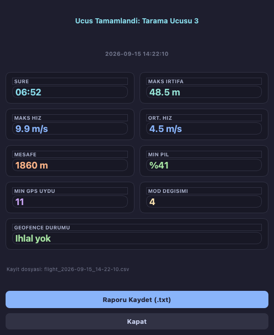

**Şekil 13.** Uçuş sonrası özet raporu

Şekil 13'te görülen pencere, staj başlangıcında DISARM anında **kendiliğinden** açılmaktaydı. Ancak RTL ve LAND gibi süreçler sırasında otopilot kısa süreli, gerçek olmayan bir DISARM görünümü üretebildiğinden, pencere beklenmedik anlarda operatörün önüne çıkıyordu. Bu davranış değiştirilmiş; özet artık saklanmakta ve kontrol panelindeki "SON UÇUŞ ÖZETİ" butonu aktifleşmektedir. Buton, uçuş süresini de göstererek hangi uçuşa ait olduğunu belirtmektedir. Pilot hazır olduğunda butona basarak özeti görüntülemektedir.

### Tekrar oynatma

Kaydedilen uçuşlar, harita üzerinde ve telemetri kartlarında geriye dönük olarak oynatılabilmektedir. Oynatma paneli Şekil 14'te gösterilmiştir.

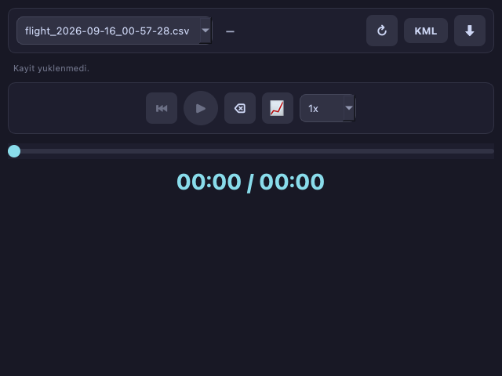

**Şekil 14.** Kayıtlı uçuşların oynatıldığı panel

Şekil 14'te görülen panel; dosya seçimi, oynat/duraklat, başa sarma, zaman çubuğu ve oynatma hızı (1x–10x) denetimlerini içermektedir. Oynatma sırasında canlı telemetri arayüzü ezmemektedir.

Bu özellikte staj kapsamında kritik bir güvenlik sorunu tespit edilmiş ve giderilmiştir; sorun Bölüm 18'de açıklanmaktadır.

### Olay günlüğü

Uçuş boyunca gerçekleşen önemli olaylar zaman damgalı olarak kaydedilmektedir. Günlük paneli Şekil 15'te gösterilmiştir.

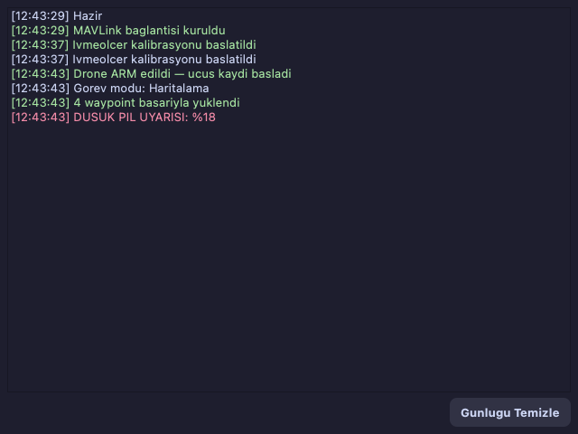

**Şekil 15.** Zaman damgalı olay günlüğü

Şekil 15'te görüldüğü gibi olaylar başarı durumuna göre renklendirilmektedir: başarılı işlemler yeşil, uyarı ve hatalar kırmızı, bilgi mesajları nötr renkte gösterilmektedir.

---

## 15 DIŞA AKTARMA

Geliştirilen yazılımın diğer sistemlerle birlikte çalışabilmesi amacıyla iki endüstri standardı biçim desteklenmektedir.

**QGC WPL 110 (`.waypoints`)**, Mission Planner ve QGroundControl gibi yer istasyonu yazılımlarının okuduğu, sekmeyle ayrılmış düz metin görev biçimidir [5]. Her satır; sıra numarası, aktiflik bayrağı, koordinat çerçevesi, komut kimliği, dört parametre, enlem, boylam, irtifa ve otomatik devam bayrağı alanlarından oluşmaktadır. Dosyanın sıfırıncı satırı kalkış noktasıdır ve mutlak koordinat çerçevesini kullanır; gerçek waypoint'ler birinci satırdan itibaren, kalkışa göre göreli irtifa çerçevesiyle yazılmaktadır.

**KML (Keyhole Markup Language)**, coğrafi verilerin paylaşımı için kullanılan XML tabanlı bir biçimdir ve Google Earth tarafından desteklenmektedir [9]. Projede hem planlanan görev hem de gerçekleşmiş uçuş kaydı KML'e aktarılabilmektedir. Rota, zemine göre yükseklikte çizilen bir çizgi olarak üretilmekte; görev aktarımında her waypoint için, uçuş kaydı aktarımında ise kalkış ve iniş noktaları için işaretçi eklenmektedir.

KML biçiminde dikkat edilmesi gereken bir ayrıntı, koordinat sırasının **boylam, enlem, irtifa** şeklinde olmasıdır. Enlem ve boylamın yer değiştirmesi rotanın dünyanın bambaşka bir noktasında çizilmesine yol açar; bu nedenle biçimin doğruluğu otomatik testle güvence altına alınmıştır.

---

## 16 TEST ALTYAPISI VE DOĞRULAMA

Staj başlangıcında projede hiç otomatik test bulunmamaktaydı. Yapılan her değişikliğin doğruluğunu elle denemek hem zaman alıcı hem de eksik kalmaya açıktı. Bu nedenle iki katmanlı bir doğrulama altyapısı kurulmuştur.

### Sahte araç ile otomatik testler

Testlerin gerçek bir uçuş kontrolcüsüne veya simülasyona bağımlı olmaması için, aynı bilgisayarda UDP üzerinden MAVLink konuşan bir **sahte araç** (`FakeVehicle`) geliştirilmiştir. Bu bileşen; HEARTBEAT, konum, hız, GPS, pil ve telemetri radyosu mesajları yayınlamakta, görev/fence/rally yükleme ve indirme protokollerine yanıt vermekte ve kalibrasyon akışını taklit edebilmektedir.

Sahte araç yaklaşımının simülasyona göre üstünlükleri şunlardır: testler 203 test için toplam bir dakikanın altında tamamlanmakta, her çalıştırmada aynı sonucu üretmekte ve hata durumları (düşük pil, geofence ihlali, ARM reddi) tek satırla üretilebilmektedir.

Arayüz testleri Qt'nin ekransız (offscreen) kipinde çalıştırılmakta, sesli uyarılar ise sahte bir arka uca yönlendirilmektedir; böylece test sırasında bilgisayar konuşmamakta ve gerçek uçuş kayıtları klasörüne dosya bırakılmamaktadır.

Testlerin konulara göre dağılımı Şekil 16'da gösterilmektedir.

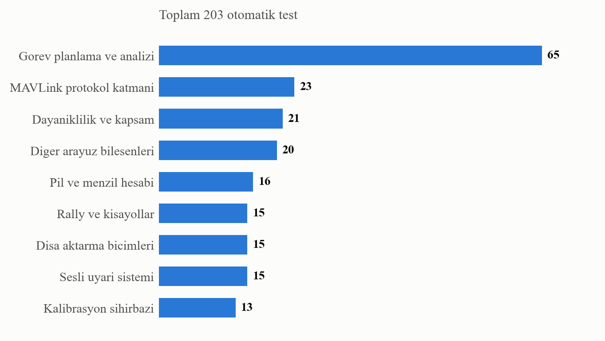

**Şekil 16.** Otomatik testlerin konu alanlarına göre dağılımı

Şekil 16'da görüldüğü üzere en geniş kapsam görev planlama ve analizi alanındadır; bu alan hem geometri algoritmalarını hem de güvenlik denetimlerini içermektedir. Test dosyalarının ayrıntılı dağılımı Tablo 5'te verilmiştir.

**Tablo 5.** Test dosyaları ve kapsadıkları konular

| Test dosyası | Test sayısı | Kapsam |
|---|---|---|
| test_mission_planner.py | 29 | Rota üretim geometrisi, izdüşüm, poligon işlemleri |
| test_mission_analysis.py | 19 | Görev ölçümleri ve güvenlik uyarıları |
| test_mission_modes.py | 17 | Görev modu arayüzü, rota üretme penceresi |
| test_battery.py | 16 | Pil hesapları, eve dönüş menzili |
| test_voice_alerts.py | 15 | Sesli uyarı kuyruğu, tekrar engelleme |
| test_exporters.py | 15 | `.waypoints` ve KML biçimleri |
| test_rally_ve_kisayollar.py | 15 | Acil iniş noktaları, klavye kısayolları |
| test_calibration.py | 13 | Pusula ve ivmeölçer kalibrasyon akışı |
| test_drone_telemetry.py | 10 | MAVLink mesaj çözümleme, görev protokolü |
| test_saglamlik.py | 9 | Disk/izin hataları, temiz kapanma |
| test_tum_butonlar.py | 7 | Tüm butonların kapsam taraması |
| test_arm_hata_bildirimi.py | 7 | ARM reddi sebebinin bildirilmesi |
| test_map_widget.py | 6 | Harita altlık katmanları |
| test_mavlink_surumu.py | 6 | MAVLink sürüm regresyonu |
| test_connection_dialog.py | 5 | Bağlantı ayarları penceresi |
| test_flight_summary.py | 5 | Uçuş özeti butonu |
| test_replay_guvenlik.py | 5 | Oynatma sırasında ARM tespiti |
| test_rssi.py | 4 | Sinyal gücü göstergesi |
| **Toplam** | **203** | |

Tablo 5'teki testlere ek olarak, arayüzdeki tüm butonlara sırayla basan bir **kapsam taraması** yazılmıştır. Bu test; bağlantı varken, bağlantı yokken, araç ARM durumdayken ve farklı görev modlarında butonları tek tek deneyerek hiçbirinin istisna fırlatmadığını doğrulamaktadır. Bölüm 18'de anlatılan iki önemli hata bu test sayesinde bulunmuştur.

### SITL ile protokol doğrulama

Otomatik testler, gönderilen komutların doğru olduğunu gösterir; ancak gerçek otopilotun bu komutlara verdiği yanıtın varsayımlarla örtüştüğünü göstermez. Bu boşluğu kapatmak için ArduPilot SITL simülasyonu kurulmuş ve elle çalıştırılan bir protokol doğrulama betiği yazılmıştır.

Betik, gerçek ArduPilot'a bağlanarak 24 kontrol yapmaktadır. Sonuçlar Tablo 6'da özetlenmiştir.

**Tablo 6.** SITL üzerinde yapılan protokol doğrulamaları

| Doğrulama alanı | Kontrol sayısı | Sonuç |
|---|---|---|
| Temel telemetri çözümlemesi | 5 | Tümü geçti |
| RTL irtifa parametresi yazımı | 2 | Tümü geçti |
| Görev yükleme / geri okuma | 3 | Tümü geçti |
| Fence ve rally tablolarının ayrılığı | 6 | Tümü geçti |
| İvmeölçer kalibrasyon protokol akışı | 5 | Tümü geçti |
| Pusula kalibrasyonu ilerleme mesajları | 3 | Tümü geçti |
| **Toplam** | **24** | **24 / 24** |

Tablo 6'daki "fence ve rally tablolarının ayrılığı" başlığı özellikle önemlidir. Bu kontrol; önce bir görev yükleyip, ardından güvenlik sınırı ve acil iniş noktaları yükleyerek, en sonunda görevin hâlâ yerinde olduğunu doğrulamaktadır. Böylece üç ayrı veri tablosunun birbirini ezmediği gösterilmektedir.

---

## 17 PAKETLEME VE DAĞITIM

Yazılımın Python kurulu olmayan bir bilgisayarda da çalışabilmesi için PyInstaller kullanılarak tek dosyalık çalıştırılabilir paket üretilmiştir [8]. Paketleme, geliştirme sürecinin en sonuna bırakılmıştır; her kod değişikliğinden sonra paketlemenin tekrarlanması gerektiğinden, geliştirme bitmeden yapılması zaman kaybı olacaktır.

Paketleme sürecinde karşılaşılan başlıca zorluk, gömülü tarayıcı bileşeninin (QtWebEngine) ihtiyaç duyduğu kaynak dosyalarının pakete dahil edilmesidir. Bu dosyalar paketleme tanımında açıkça toplanmaktadır.

Üretilen paket yaklaşık 145 MB boyutundadır ve çift tıklamayla çalışmaktadır. Uygulama, uçuş kayıtlarını çalıştırılabilir dosyanın yanındaki klasöre yazmaktadır.

Önemli bir kısıt olarak PyInstaller **çapraz derleme yapmamaktadır**: Windows için çalıştırılabilir dosya üretmek amacıyla paketlemenin bir Windows bilgisayarda çalıştırılması gerekmektedir.

---

## 18 KARŞILAŞILAN SORUNLAR VE ÇÖZÜMLERİ

Bu bölümde staj süresince tespit edilen ve giderilen önemli sorunlar ele alınmaktadır. Sorunlar Tablo 7'de özetlenmiş, ardından kritik olanlar ayrıntılandırılmıştır.

**Tablo 7.** Tespit edilen başlıca sorunlar ve çözümleri

| Sorun | Tespit yöntemi | Çözüm |
|---|---|---|
| Kayıt oynatılırken ARM hiç fark edilmiyordu | Buton kapsam taraması | HEARTBEAT her zaman işleniyor, ARM'da oynatma duruyor |
| Yeniden bağlanma portu kilitliyordu | Buton kapsam taraması | Kesilebilir bekleme, garantili soket kapatma |
| Uçuş kaydı açılamazsa ARM işleme yarıda kesiliyordu | Kod incelemesi | Kaydedici hatalarını yutup bildiriyor |
| Failsafe parametreleri hiç okunmuyordu | Statik kod analizi | Liste modül düzeyine taşındı |
| RTL irtifası eski firmware'de sessizce kayboluyordu | ArduPilot kaynak incelemesi | İki parametre adına da doğru birimde yazılıyor |
| Uzun görev işlemleri sahte bağlantı alarmı üretiyordu | Kod incelemesi | Bekleme sırasında telemetri akıtılıyor |
| MAVLink 1 diyalekti kullanılıyordu | Rally geliştirmesi | MAVLink 2'ye geçildi |
| İvmeölçer adımları yanlış kanaldan okunuyordu | SITL doğrulaması | Otopilotun komut kanalı kullanılıyor |
| Uygulama açılışta uzun süre donuyordu | Paketleme denemesi | matplotlib içe aktarımı tembelleştirildi |
| Harita altlığı filigranlı geliyordu | Görsel inceleme | Anahtar gerektirmeyen kaynaklara geçildi |

### Kayıt oynatma sırasında ARM tespitinin yapılmaması

Tespit edilen en kritik sorun budur. Telemetri işleme fonksiyonu, kayıt oynatılırken fonksiyonun en başında koşulsuz olarak geri dönmekteydi. ARM tespiti de aynı fonksiyonun içinde yer aldığından, oynatma bir kez başladığında araç ARM olsa bile yazılım bunu **hiç fark etmiyordu**.

Bu durumun pratik sonucu şudur: operatör havadaki bir aracın yanında, kayıtlı bir uçuşun irtifa, konum ve pil değerlerini canlı veri sanarak izleyebilirdi. Harita geçmiş bir rotayı gösterirken araç bambaşka bir yerde olabilirdi.

Çözüm iki katmanlıdır. Birincisi, HEARTBEAT mesajı artık her koşulda işlenmekte; ARM tespit edildiğinde oynatma durdurulmakta, canlı telemetriye dönülmekte ve operatör hem ekrandan hem sesli olarak uyarılmaktadır. İkincisi, araç ARM durumdayken oynatma butonu tamamen devre dışı bırakılmaktadır.

### Yeniden bağlanma sırasında soket sızıntısı

"Yeniden Bağlan" butonuna arka arkaya basıldığında uygulama kalıcı olarak bağlantısız kalabiliyordu. Kök sebep iki ayrı eksiklikti:

Birincisi, MAVLink bağlantı nesnesi kurulum sırasında hata alırsa (örneğin heartbeat beklerken zaman aşımına uğrarsa) açtığı UDP soketini kapatmıyordu. İkincisi, iş parçacığını durduran fonksiyonun bekleme süresi (8 saniye), heartbeat bekleme süresinden (10 saniye) kısaydı. Süre dolduğunda iş parçacığı zorla sonlandırılıyor, bu durumda temizlik bloğu hiç çalışmıyor ve soket açık kalıyordu. Sonraki bağlantı denemesi "Address already in use" hatasıyla düşüyordu.

Çözümde heartbeat beklemesi kesilebilir hâle getirilmiş, hata durumunda soketin kapatılması garanti altına alınmış, durdurma süresi uzatılmış ve aynı anda iki bağlantı oluşmasını engelleyen bir koruma eklenmiştir.

### MAVLink sürüm uyumsuzluğu

Acil iniş noktaları geliştirilirken, pymavlink kütüphanesinin varsayılan olarak **MAVLink 1** diyalektini yüklediği tespit edilmiştir. MAVLink 1 tanımlarında görev mesajlarının `mission_type` alanı bulunmamakta ve fonksiyon imzalarında son parametre farklı bir anlam taşımaktadır:

```
MAVLink 1:  mission_clear_all_send(sistem, bileşen, force_mavlink1)
MAVLink 2:  mission_clear_all_send(sistem, bileşen, mission_type, force_mavlink1)
```

Kod MAVLink 2 imzasına göre yazıldığından, güvenlik sınırı tipini belirten değer sessizce yanlış parametreye geçmekte ve `mission_type` bilgisi hiç gönderilmemekteydi.

SITL üzerinde yapılan ölçüm, bu durumun veri kaybına yol açmadığını göstermiştir: ArduPilot, gelen öğenin komut kimliğinden doğru tabloyu çıkarabildiği için güvenlik sınırı yine kendi tablosuna ulaşmakta ve uçuş görevi bozulmamaktadır. Ancak bu davranış tamamen otopilotun toleransına bağlıdır; protokolün açıkça bildirmesi gereken bilgi gönderilmemektedir ve başka bir otopilot ya da sürüm bunu reddedebilir.

Çözüm olarak MAVLink 2 diyalekti açıkça seçilmiştir. Düzeltme, içe aktarma sırasından bağımsız çalışacak biçimde tasarlanmış ve geri dönüşü engelleyen altı test yazılmıştır.

### İvmeölçer kalibrasyonunda yanlış bildirim kanalı

Kalibrasyon sihirbazının ilk sürümü, otopilotun istediği pozisyonu `STATUSTEXT` mesajının metninden ("Place vehicle level and press any key.") çıkarmaktaydı. SITL ile yapılan doğrulamada bu yaklaşımın hatalı olduğu görülmüştür.

ArduPilot kaynak kodu incelendiğinde, otopilotun yer istasyonundan ilk yanıtı alır almaz metin bildirimini kapattığı tespit edilmiştir. Yani "Place vehicle …" mesajları yalnızca ilk adımda gelmektedir; sonraki pozisyonlar yer istasyonuna `MAV_CMD_ACCELCAL_VEHICLE_POS` komutuyla bildirilmektedir. Canlı olarak yakalanan akış şu şekildedir:

```
Otopilot → COMMAND_LONG ACCELCAL_VEHICLE_POS param1=1   (düz)
Otopilot → STATUSTEXT "Place vehicle level and press any key."
GCS      → yanıt
Otopilot → COMMAND_LONG ACCELCAL_VEHICLE_POS param1=2   (sol yan)  [metin YOK]
```

Sihirbaz bu kanalı kullanacak şekilde düzeltilmiş, metin tabanlı çözümleme ise eski davranışa karşı yedek olarak korunmuştur.

### Uygulamanın açılışta donması

Paketlenmiş sürümün ilk denemesinde uygulama açılıyor ancak arayüz gelmiyordu. Konsol çıktısı alabilen bir tanı paketi derlenerek sorunun kaynağı bulunmuştur: oynatma paneli, modül düzeyinde grafik kütüphanesini (matplotlib) yüklemekteydi. Bu kütüphane açılışta font taraması yapmakta ve macOS'ta bunun için sistem aracı çalıştırdığından onlarca saniye sürmekteydi. Üstelik tek dosyalık pakette kütüphanenin yapılandırma dizini her çalıştırmada silinen geçici klasöre düştüğünden, tarama **her açılışta** tekrarlanmaktaydı.

Çözümde grafik penceresinin içe aktarımı, pencere açıldığı ana ertelenmiş ve paketlenmiş sürümde önbellek dizini kalıcı hâle getirilmiştir. Bu değişiklikle uygulamanın modül yükleme süresi 0,39 saniyeye inmiştir.

---

## 19 SONUÇ

Bu staj çalışması kapsamında, ArduPilot tabanlı insansız hava araçları için Türkçe arayüze sahip bir yer kontrol istasyonu yazılımı geliştirilmiştir. Çalışma sonunda yazılım; gerçek zamanlı telemetri izleme, otonom görev planlama, göreve özgü otomatik rota üretimi, uçuş öncesi güvenlik analizi, sensör kalibrasyonu, pil menzil hesabı, sesli uyarı, uçuş kaydı ve tekrar oynatma ile endüstri standardı biçimlere dışa aktarma yeteneklerine sahip hâle gelmiştir.

### Staj çalışmasının öğrenciye katkıları

Bu çalışma, üniversite eğitiminde teorik olarak öğrenilen konuların gerçek bir mühendislik probleminde nasıl birleştiğini göstermesi açısından öğretici olmuştur. Özellikle şu alanlarda kazanım sağlanmıştır:

**Eşzamanlı programlama.** Grafik arayüz ile ağ haberleşmesinin ayrı iş parçacıklarında yürütülmesi, paylaşılan durum yerine kuyruk ve sinyal tabanlı haberleşme kullanılması, gerçek bir eşzamanlılık probleminin çözümü olarak deneyimlenmiştir.

**Protokol seviyesinde çalışma.** İkili bir haberleşme protokolünün belgelerini okuyup gerçeklemek, protokol sürümleri arasındaki farkların pratik sonuçlarını görmek ve gerektiğinde otopilotun kaynak kodunu inceleyerek davranışını doğrulamak, belgelere körü körüne güvenmemek gerektiğini göstermiştir.

**Test yazmanın değeri.** Staj başlangıcında hiç testi olmayan projede, sonunda 203 otomatik test bulunmaktadır. Daha önemlisi, en kritik iki hata elle deneme sırasında değil, otomatik kapsam taraması sırasında bulunmuştur. Bu deneyim, testin yalnızca "doğruluğu kanıtlama" değil, aynı zamanda "hata keşfetme" aracı olduğunu göstermiştir.

**Güvenlik odaklı tasarım düşüncesi.** Bir uçuş yazılımında hatanın maliyeti yüksektir. "Eksik veriyle tahmin üretme", "kullanıcı onaylamadan kalıcı yazma yapma", "tehlikeli komutu kısayola bağlama" gibi kararlar, işlevsellikten önce güvenliği gözeten bir bakış açısının ürünüdür.

### Projenin eksikleri ve gelecek çalışmalar

Yazılım mevcut hâliyle çalışır durumda olmakla birlikte, geliştirmeye açık yönleri bulunmaktadır:

**Gerçek donanımla test.** Tüm doğrulamalar simülasyon ortamında yapılmıştır. Yazılımın gerçek bir uçuş kontrolcüsü ve telemetri radyosuyla saha testinden geçirilmesi gerekmektedir. Özellikle ivmeölçer kalibrasyonunun tam akışı, simülasyondaki araç fiziksel olarak döndürülemediği için tamamlanamamaktadır.

**Görev komut çeşitliliği.** Şu anda her waypoint basit bir seyir noktası olarak yüklenmektedir. Kalkış, iniş, noktada bekleme, hız değiştirme ve özellikle yük bırakma (servo tetikleme) komutlarının eklenmesi, yazılımın yarışma ve saha görevlerinde kullanılabilirliğini artıracaktır.

**Canlı video akışı.** Birçok saha uygulamasında araç üzerindeki kameradan gelen görüntünün yer istasyonunda izlenmesi gerekmektedir. Bu özellik ayrı bir çalışma kapsamında değerlendirilmelidir.

**Uçuş kaydı analizi.** Otopilotun kendi tuttuğu ayrıntılı kayıt dosyalarının indirilip incelenmesi, uçuş sonrası analiz için değerli olacaktır.

**Ayarların kalıcılığı.** Bağlantı adresi, ses tercihi ve pencere boyutu gibi kullanıcı tercihleri şu anda her açılışta sıfırlanmaktadır.

**Arayüz kodunun modülerleştirilmesi.** Ana pencere sınıfı 2.044 satır ve 91 metottan oluşmaktadır. Bu sınıfın panel bazlı alt bileşenlere ayrılması bakım kolaylığı sağlayacaktır.

> **[BU BÖLÜM DOLDURULACAK]**
> Staj yönergesi gereği sonuç bölümünde ayrıca şu noktalara değinilmelidir:
> - Yapılan çalışmanın **staj yerine katkıları**
> - Projenin **hangi aşamada firma yetkililerine sunulduğu** ve alınan geri bildirimler
> - Gelecekte proje ile ilgili **başka çalışmaların planlanıp planlanmadığı**

---

## 20 KAYNAKLAR

[1] ArduPilot Development Team, "ArduPilot Documentation," [Çevrimiçi]. Erişim adresi: https://ardupilot.org/ardupilot/ [Erişim tarihi: 16 Eylül 2026].

[2] MAVLink Development Team, "MAVLink Developer Guide — Micro Air Vehicle Communication Protocol," [Çevrimiçi]. Erişim adresi: https://mavlink.io/en/ [Erişim tarihi: 16 Eylül 2026].

[3] Riverbank Computing, "PyQt5 Reference Guide," [Çevrimiçi]. Erişim adresi: https://www.riverbankcomputing.com/static/Docs/PyQt5/ [Erişim tarihi: 16 Eylül 2026].

[4] ArduPilot Development Team, "pymavlink — Python MAVLink Library," [Çevrimiçi]. Erişim adresi: https://github.com/ArduPilot/pymavlink [Erişim tarihi: 16 Eylül 2026].

[5] ArduPilot Development Team, "Mission Planner Documentation," [Çevrimiçi]. Erişim adresi: https://ardupilot.org/planner/ [Erişim tarihi: 16 Eylül 2026].

[6] V. Agafonkin, "Leaflet — an open-source JavaScript library for mobile-friendly interactive maps," [Çevrimiçi]. Erişim adresi: https://leafletjs.com/ [Erişim tarihi: 16 Eylül 2026].

[7] OpenStreetMap Foundation, "OpenStreetMap," [Çevrimiçi]. Erişim adresi: https://www.openstreetmap.org/copyright [Erişim tarihi: 16 Eylül 2026].

[8] PyInstaller Development Team, "PyInstaller Manual," [Çevrimiçi]. Erişim adresi: https://pyinstaller.org/en/stable/ [Erişim tarihi: 16 Eylül 2026].

[9] Open Geospatial Consortium, "OGC KML 2.3 Standard," OGC 12-007r2, 2015.

[10] H. Choset, "Coverage for robotics — A survey of recent results," *Annals of Mathematics and Artificial Intelligence*, vol. 31, pp. 113–126, 2001.

[11] International Maritime Organization and International Civil Aviation Organization, *International Aeronautical and Maritime Search and Rescue (IAMSAR) Manual, Volume III: Mobile Facilities*, IMO/ICAO.

[12] Python Software Foundation, "unittest — Unit testing framework," Python 3 Documentation, [Çevrimiçi]. Erişim adresi: https://docs.python.org/3/library/unittest.html [Erişim tarihi: 16 Eylül 2026].

[13] ArduPilot Development Team, "SITL Simulator (Software in the Loop)," [Çevrimiçi]. Erişim adresi: https://ardupilot.org/dev/docs/sitl-simulator-software-in-the-loop.html [Erişim tarihi: 16 Eylül 2026].

[14] Gökkubbe Teknoloji A.Ş., "Kurumsal Tanıtım," [Çevrimiçi]. Erişim adresi: https://www.gokkubbetech.com/ [Erişim tarihi: 16 Eylül 2026].

---

## EKLER

### Ek-1 Proje Kaynak Kodları

Projenin tüm kaynak kodları, sürüm geçmişiyle birlikte aşağıdaki adreste yer almaktadır:

**https://github.com/haticenurr/ardupilot_gcs_projem**

Kod tabanının dosya bazında dağılımı aşağıda verilmiştir.

| Dosya / Klasör | Satır | Açıklama |
|---|---|---|
| `main_v7.py` | 2.786 | Ana pencere, telemetri iş parçacığı, olay işleyicileri |
| `core/drone_telemetry.py` | 1.348 | MAVLink protokol katmanı |
| `core/mission_planner.py` | 288 | Rota üretim geometrisi |
| `core/voice_alerts.py` | 218 | Sesli uyarı altyapısı |
| `core/mission_analysis.py` | 193 | Görev ölçümleri ve güvenlik denetimleri |
| `core/exporters.py` | 181 | `.waypoints` ve KML üretimi |
| `core/flight_logger.py` | 122 | CSV uçuş kaydı |
| `core/battery.py` | 111 | Pil ve menzil hesapları |
| `core/mavlink_env.py` | 54 | MAVLink 2 diyalekt seçimi |
| `core/app_paths.py` | 21 | Uygulama dizinleri |
| `ui/` (16 dosya) | 4.019 | Paneller ve diyalog pencereleri |
| `tests/` (21 dosya) | 3.649 | Otomatik testler, sahte araç, SITL doğrulama |
| **Toplam (kaynak)** | **9.341** | |

### Ek-2 Kurulum ve Çalıştırma Yönergesi

**Geliştirme ortamı kurulumu:**

```
python3 -m venv .venv
source .venv/bin/activate
python -m pip install -r requirements.txt
python main_v7.py
```

**SITL simülasyonu ile çalıştırma:**

```
./build/sitl/bin/arducopter --model quad \
    --serial0 tcp:5760 \
    --serial1 udpclient:127.0.0.1:14550 \
    --defaults Tools/autotest/default_params/copter.parm
```

**Otomatik testlerin çalıştırılması:**

```
python -m unittest discover -s tests -v
```

**Paketleme:**

```
pyinstaller --noconfirm --clean gcs.spec
```

### Ek-3 Ekran Görüntüleri

Raporda yer alan tüm ekran görüntüleri, yazılımın simülasyon ortamına bağlı çalışan hâlinden alınmıştır. Görüntülerin yüksek çözünürlüklü hâlleri proje deposundaki `rapor/gorseller/` klasöründe bulunmaktadır.

> **[BU BÖLÜME EKLENEBİLİR]**
> Staj yönergesi, iş yerinde staj yapan kişinin de karede bulunduğu fotoğrafların rapora eklenmesini önermektedir. Bu fotoğraflar Ek-4 olarak eklenebilir.
